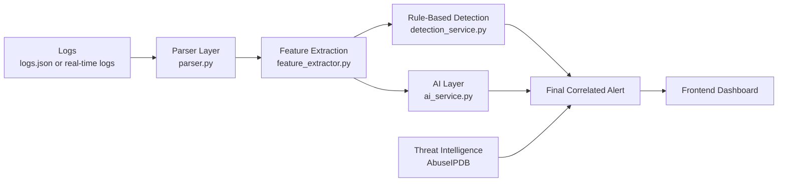

# Threat Intelligence System Flowchart

This file explains both:

- the current implemented project flow
- the enhanced interview-ready flow with AI + AbuseIPDB enrichment

## Current Implemented Flow

```mermaid
flowchart TD
    A[Log Data Input<br/>backend/data/logs.json or sample_logs.csv]
    B[Log Service<br/>read_logs()]
    C[Parser Layer<br/>load_json_logs / load_csv_logs]
    D[Structured Log Entries<br/>LogEntry model]

    E[Detection Service<br/>analyze_logs()]
    F[Rule-Based Threat Detection]
    F1[Brute Force Attack]
    F2[Unusual Login Time]
    F3[Unknown IP Access]
    G[Alerts Output<br/>Alert model]

    H[Feature Extractor<br/>extract_features()]
    I[ML Prediction Layer<br/>ml/predict.py]
    J[Threat Prediction Output<br/>risk_score, predicted_level,<br/>indicators, recommendations]

    K[Summary Service<br/>generate_summary()]
    L[Threat Summary Output<br/>total_alerts, high_threats,<br/>top_sources, message]

    M[FastAPI Routes]
    M1[GET /logs]
    M2[GET /alerts]
    M3[GET /analyze]
    M4[GET /summary]

    N[Frontend API Layer<br/>frontend/src/services/api.js]
    O[React App<br/>App.jsx]
    P[Dashboard Page]
    Q[Alerts Page]
    R[Logs Page]
    S[Analytics Page]
    T[Settings Page]

    A --> B
    B --> C
    C --> D

    D --> E
    E --> F
    F --> F1
    F --> F2
    F --> F3
    F1 --> G
    F2 --> G
    F3 --> G

    D --> H
    G --> H
    H --> I
    I --> J

    D --> K
    G --> K
    K --> L

    D --> M1
    G --> M2
    G --> M3
    J --> M3
    L --> M3
    L --> M4

    M1 --> M
    M2 --> M
    M3 --> M
    M4 --> M

    M --> N
    N --> O

    O --> P
    O --> Q
    O --> R
    O --> S
    O --> T
```

## Step-By-Step Flow

1. The system reads log files from `backend/data/logs.json` or `backend/data/sample_logs.csv`.
2. `read_logs()` in the backend loads and parses the raw log records.
3. Parsed data is converted into structured `LogEntry` objects.
4. The detection service checks the logs for suspicious activity:
   - brute-force login attempts
   - unusual login times
   - unknown IP access
5. These detections become `Alert` objects.
6. The feature extractor builds numeric features from logs and alerts.
7. The ML prediction module calculates:
   - risk score
   - threat level
   - indicators
   - recommendations
8. The summary service creates a high-level report of the security state.
9. FastAPI exposes this data using:
   - `/logs`
   - `/alerts`
   - `/analyze`
   - `/summary`
10. The React frontend fetches this backend data.
11. The frontend displays it in the Dashboard, Alerts, Logs, Analytics, and Settings pages.

## Simple Project Meaning

In one sentence:

> This project reads system activity logs, detects suspicious behavior, predicts threat risk, and shows the results in a dashboard.

## Interview-Ready Enhanced Flow

Important note:

> AbuseIPDB enrichment is now implemented as an optional backend feature. It activates when `ABUSEIPDB_API_KEY` is configured; otherwise the project falls back to local rule-based + AI analysis only.

### High-Level Flow

```text
Logs -> Parser -> Detection -> Suspicious Public IPs -> AI -> Threat Intel (AbuseIPDB) -> Final Alert -> Frontend
```

### Enhanced Flowchart



## Interview-Ready Step-By-Step Explanation

### 1. Log Ingestion

- Source: `logs.json` or future real-time logs
- Raw fields include:
  - IP address
  - timestamp
  - event type
  - status

### 2. Parsing And Feature Extraction

- `parser.py` cleans and structures incoming log fields
- `feature_extractor.py` generates useful features such as:
  - failed login count
  - unique IP count
  - login time patterns

### 3. Rule-Based Detection

- `detection_service.py` checks for suspicious patterns
- It detects:
  - brute-force attempts
  - unusual login times
  - unknown IP access
- Output: basic alerts

### 4. AI Layer

- `ai_service.py` receives extracted features
- The AI/ML layer returns:
  - `risk_score`
  - `threat_level`
  - `prediction`

### 5. Threat Intelligence Enrichment With AbuseIPDB

- For each suspicious IP, the system can query AbuseIPDB:

```http
GET https://api.abuseipdb.com/api/v2/check?ipAddress=IP
```

- AbuseIPDB can return:
  - abuse confidence score
  - country
  - ISP
  - usage type
  - report count

- Example enrichment:

```json
{
  "ip": "1.2.3.4",
  "abuse_score": 85,
  "country": "Russia",
  "isp": "XYZ Network",
  "is_malicious": true
}
```

### 6. Final Alert Correlation

- The final alert combines:
  - rule-based detection result
  - AI prediction
  - AbuseIPDB intelligence

- Example final alert:

```json
{
  "type": "Brute Force",
  "ip": "1.2.3.4",
  "severity": "High",
  "ai_risk": 0.82,
  "abuse_score": 85,
  "country": "Russia",
  "summary": "High-risk IP with multiple failed logins and abuse reports"
}
```

### 7. Frontend Display

- The frontend presents enriched security data in:
  - Alerts page
  - Dashboard cards and charts
  - AI summary panel
  - optional IP details modal

## Best Short Interview Description

> The system ingests security logs, applies rule-based detection, generates an AI threat score, enriches suspicious IPs using threat intelligence like AbuseIPDB, and then displays correlated alerts in a frontend dashboard.
